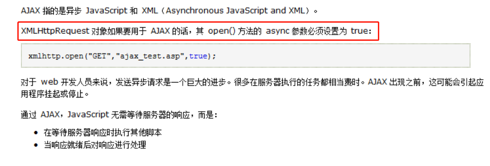

## 原生ajax

### 1. 基本语法

```js
var xml = new XMLHttpRequest()  // 得到xml对象
xml.onreadystatechange = function(){}  // 监听响应
xml.open()  // 建立连接
xml.send()  // 发送请求

// 或者可以在这使用onload监听响应
xml.onload = function(){} 
```


### 2. 基本语法详解

#### 2.1 open()方法

> open()方法的作用是用来建立连接，支持传入三个参数：①请求方式 ②接口地址 ③同步/异步

示例：

```js
xml.open('get','/getusers',false)
```

!> open()的第三个参数：true为异步(默认)，false为同步(不推荐)


#### 2.2 send()方法

> send()方法的作用是用来发送请求，支持传入参数：null/字符串

示例：

```js
xml.send(null)
// 或者
xml.sned("name=tom&age=18")  // post传参，需要设置HTTP头，详见3.2章节
```

!> 当请求方式为post并传参时，需要在send()中传参；如为get，则在open()接口地址后传参


#### 2.3 onload

> onload为客户端得到服务器端响应后触发的回调函数，可以在该回调函数中处理响应及后续行为

示例：

```js
xml.onload = function(){
    var res = xml.response
    if(res.code === 200){
        window.location.href = './list.html'
    }else{
        alert(res.message)
    }
}
```

!> onload只能监听readyState 等于4时的状态，其他状态值下无法触发onload,若想监听readyState值变化，可以使用onreadystatechange【readyState 值详见3.1章节】


#### 2.4 onreadystatechange

> onreadystatechange和onload使用方法和作用极其类似，都可监听响应。唯一不同的是，onload无法监听readyState值变化。而每次readyState值变化都会触发onreadystatechange，当 readyState 为 3 时，它也可能调用多次


### 3. 进阶

#### 3.1 关于readyState

?> readyState是ajax的状态值，不同的状态代表着ajax进行到了不同的阶段，共有5个值：0,1,2,3,4

| 状态值 |     名称      |                             描述                             |
| :----: | :-----------: | :----------------------------------------------------------: |
|   0    | Uninitialized | 初始化状态。XMLHttpRequest 对象已创建或已被 abort() 方法重置。 |
|   1    |     Open      | open() 方法已调用，但是 send() 方法未调用。请求还没有被发送。 |
|   2    |     Sent      | Send() 方法已调用，HTTP 请求已发送到 Web 服务器。未接收到响应。 |
|   3    |   Receiving   |      所有响应头部都已经接收到。响应体开始接收但未完成。      |
|   4    |    Loaded     |                   HTTP 响应已经完全接收。                    |

#### 3.2 关于get/post传参

3.2.1 get传参，直接在接口地址后传参，例如：

```js
xml.open('get','getusers?name=tom&age=18')
```

3.2.2 post，需要在send()中传参，并在send()前设置HTTP 头，例如：

```js
xmlhttp.setRequestHeader("Content-type","application/x-www-form-urlencoded");
xml.send("name=tom&age=18")
```


#### 3.3 关于同步/异步

W3C手册中有这么一句话，如图：



虽然官方说不推荐使用 async=false同步，但是对于一些小型的请求，也是可以的

但会导致一个问题：如果服务器繁忙或缓慢，应用程序会挂起或停止。

原因：JavaScript 会等到服务器响应就绪才继续执行。

所以，不推荐使用同步


!> 当使用 async=false 时，请不要编写 onreadystatechange 函数 ，把代码放到 send() 后面即可

```js
xml.open("GET","/getusers",false)
xml.send()
document.getElementById("box").innerHTML = xml.responseText
```


#### 3.4 关于响应

##### 3.4.1 接收数据

?> 如果想要获取服务器返回的响应，使用responseText 或 responseXML 属性

```js
var xml = new XMLHttpRequest()
xml.onreadystatechange = function(){
    if(xml.readyState == 4 && xml.status==200){
       document.getElementById("box").innerHTML = xml.responseText
    }
}
xml.open('get','/getusers?id=1')
xml.send(null)
```


##### 3.4.2 判断响应

!> 如果使用的是onreadystatechange，请判断readyState和status，否则，将会多次触发该函数导致未知错误

?> status: ajax响应状态值。


[常见HTTP状态码-菜鸟教程](https://www.runoob.com/http/http-status-codes.html )


## JQ中的ajax


### 1.基本语法

#### 1.1 $.ajax()

```js
$.ajax({
    url : '/getusers',
    data : {},
    dataType : 'json',
    type : 'get',
    async : true,
    success : function(res){}，
    error : function(XMLHttpRequest, textStatus, errorThrown){}
})
```

##### 1.1.1 参数详解

| 属性/方法 |           描述           |               默认值/参数               |
| :-------: | :----------------------: | :-------------------------------------: |
|    url    |         接口地址         |                    -                    |
|   data    |    发送到服务器的数据    |                  null                   |
| dataType  | 预期服务器返回的数据类型 |   自动根据 HTTP 包 MIME 信息智能判断    |
|   type    |         请求方式         |                   get                   |
|   async   |        同步/异步         |               true(异步)                |
|  success  |   请求成功后的回调函数   |        data[,textStatus, jqXHR]         |
|   error   |   请求失败时调用此函数   | XMLHttpRequest, textStatus, errorThrown |

!> error函数的具体参数详见2.1章节


#### 1.2 $.post()

```js
$.post('/getusers',{},function(){},'json')
```

##### 1.2.1 参数详解

|   参数   |                            描述                             | 是否必选 |
| :------: | :---------------------------------------------------------: | :------: |
|   url    |                        请求接口地址                         |    是    |
|   data   |                    待发送 Key/value 参数                    |   可选   |
| callback |                     发送成功时回调函数                      |   可选   |
|   type   | 返回内容格式【xml、 html、script、 json、 text、 _default】 |   可选   |


#### 1.3 $.get()

```js
$.get('/getusers',{},function(){},'json')
```

参数：同上述$.post()参数

?> $.get()和$.post()是$.ajax的简写形式，其参数为固定，如果想要使用更多ajax功能，必须使用$.ajax()


### 2.关于$.ajax()

#### 2.1 error函数

?> error函数在请求失败时触发，该函数接收三个参数：*XMLHttpRequest 对象、错误信息、捕获的异常对象(可选)*


如果发生了错误，错误信息（第二个参数）除了得到null之外，还可能是"timeout", "error", "notmodified" 和  "parsererror"。


#### 2.2 success函数

?> success函数在请求成功时触发，该函数接收三个参数：*data, textStatus[可选], jqXHR[可选]*


data：由服务器返回，并根据dataType参数进行处理后的数据；

textStatus：描述状态的字符串。

jqXHR：在jQuery 1.4.x中，XMLHttpRequest对象，在jQuery 1.5， 成功设置可以接受一个函数数组。每个函数将被依次调用


### 3.JQ中使用FormData

#### 3.1 FormData的基本使用

```html
<!DOCTYPE html>
<html lang="en">
<head>
  <meta charset="UTF-8">
  <title>FormData的基本使用</title>
</head>
<body>
    <form id="form">
        姓名：<input name="username"><br>
        年龄：<input name="age"><br>
        <button>点击测试</button>
    </form>
    <script>
        $('button').click(function(){
            // 因为formdata需要的是一个dom对象，需要将jq对象转为dom对象
            var fm = $('#form')[0]
        	var fd = new FormData(fm)
            console.log(fd.get('username'))  // 获取键名为username的值
            console.log(fd.append('sex','男'))  // 向fd对象中添加一个键值对 sex:男
            console.log(fd.set('sex','女'))  // 可以修改fd中已经存在的键值对
            console.log(fd.set('city','北京'))  // 如果键名不存在，则新增一个
            console.log(fd.delete('sex'))  // 删除已经存在的键值对
        })
    	
    </script>
</body>
</html>
```

#### 3.2 $.ajax()中使用FormData

```html
<!DOCTYPE html>
<html lang="en">
<head>
  <meta charset="UTF-8">
  <title>FormData的基本使用</title>
</head>
<body>
    <form id="form">
        姓名：<input name="username"><br>
        年龄：<input name="age"><br>
        <button>点击测试</button>
    </form>
    <script>
        // 记得先引入jq文件
        $('button').click(function(){
            // 获取表单数据
            var fd = new FormData($('#form')[0])
            $.ajax({
                url : '/addusers',
                data : fd,
                dataType : 'json',
                type : 'post',
                success : function(res){
                    // 在这根据实际需求做响应处理
                }，
                contentType : false,
                processData : false
            })
        })
    </script>
</body>
</html>

```

!> $.ajax()中使用FormData比基本语法多了两个属性：*contentType，proseccData*

> contentType:false

?> JQ会默认将contentType设为 application/x-www-form-urlencoded ，所以会导致后端拿不到数据的情况,因为FormData的默认数据类型是multipart/form-data

> processData : false

?> 默认情况下，通过data选项传递进来的数据，如果是一个对象(技术上讲只要不是字符串)，都会处理转化成一个查询字符串，以配合默认内容类型  "application/x-www-form-urlencoded"，因为我们使用的是FormData，所以不需要进行数据处理


#### 3.2 node服务端接收FormData值会存在的问题

!> 在node服务端，post请求需要借助 body-parser  模块，但body-parser 并不支持 contentType: multipart/form-data 的格式类型，也就是不支持formData格式 ，这会导致前端的post请求发送formdata数据node服务端接收不到的情景


解决：

> 安装 ***connect-multiparty*** 模块

步骤详解：

①安装模块

```bash
npm i connect-multiparty 
```

②引入模块

``` 	js
const multipart = require('connect-multiparty')
const mulMiddleware = multipart()
```

③使用

```js
router.post('/addusers', mulMiddleware, (req, res) => {
    console.log(req.body); 
});
```


